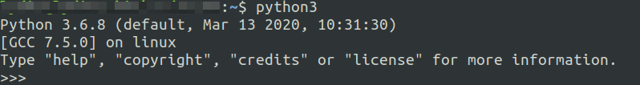
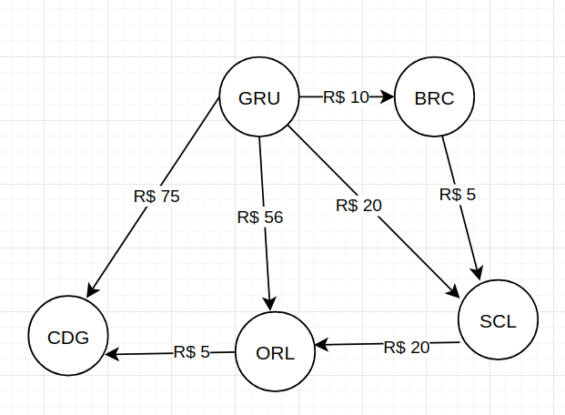

  # Calculate route test
  
> Esse repositório contém uma solução para esse [exercício proposto](README_EXERCICIO.md), sendo responsável por:
>- Cadastrar rotas de viagem, tendo origem, destino e custo
>- Listar todas as rotas cadastradas
>- Disponibilizar a rota mais barata a partir de uma origem para chegar a um determinado destino
  
Índice:
- [Como executar a aplicação](#como-executar-a-aplicação)
- [Estrutura dos arquivos](#estrutura-dos-arquivos)
- [Explicação sobre a solução](#explicação-sobre-a-solução)
- [Sobre a API](#sobre-a-api)
  
## Como executar a aplicação 
  - [Instalação dos pré requisitos e criando o ambiente virtual](#instalação-dos-pré-requisitos-e-criando-o-ambiente-virtual)
  - [Instalação das dependencias](#instalação-das-dependencias)
  - [Executando a aplicação](#executando-a-aplicação)
  
### Instalação dos pré requisitos e criando o ambiente virtual
Esse projeto utiliza python 3.6.8, para saber qual versão do python tem basta executar `python3`
 


Caso o python da sua máquina não esteja nessa versão terá que seguir as instruções desses links:
- <a href="https://docs.python-guide.org/starting/install3/linux/" target="_blank">[Para linux]</a>
- <a href="https://docs.python.org/3/using/windows.html" target_="_blank">[Para Windows]</a>

Virtualenv: https://virtualenv.pypa.io/en/latest/installation.html

Pyenv:
- <a href="https://github.com/pyenv/pyenv#installation" target="_blank">[Para linux]</a>
- <a href="https://github.com/pyenv-win/pyenv-win#installation" target_="_blank">[Para Windows]</a>

```
pyenv install 3.6.8
pyenv virtualenv 3.6.8 test-best-track
pyenv activate test-best-track
```

Obs: Como opção ao pyenv também é possível utilizar essas <a href="https://docs.python.org/3/tutorial/venv.html" target="_blank"> instruções</a>

### Instalação das dependencias
Esse projeto utiliza as seguintes dependencias
- <a href="https://flask.palletsprojects.com/en/1.1.x/" target="_blank">Flask1.1.2</a>: framework leve de python que facilita criar aplicações web
- <a href="https://flask-marshmallow.readthedocs.io/en/latest/" target="_blank">flask-marshmallow0.13.0 e marshmallow3.7.1</a>: Utilizado para criar um schema para validar as rotas 
- <a href="https://pypi.org/project/python-dotenv/" target="_blank">python-dotenv0.14.0</a>: para manter um arquivo das variáveis necessárias no projeto, o ideal é manter o `.env` no `.gitignore`, mas para demonstração e não tem dados sensíveis o arquivo foi mantido.

Após ativada a virtualenv podemos utilizar:

`pip install -r requirements.txt`

### Executando a aplicação
Para a aplicação console:
```
python console.py input-file.csv
```
Para a API:
```
python app.py input-file.csv
```
Para rodar os tests:
```
python -m unittest discover tests -v -b
```
### Estrutura dos arquivos
```
calculated-route-test
└───api
│   └───settings
|   |   config.py
│   └───track
|   |   exceptions.py
|   |   helpers.py
|   |   schema.py
|   |   views.py
└───utils
│   │   dijkstra.js
│   │   filemanager.js
└───tests
│   └───input-file-test.txt
|   └───input-file-test.csv
|   └───...test_files.py
|   app.py
|   console.py
|   .env
|   input-file.csv
|   requirements.txt
|   ...info files
```
As decisões de estrutura e design são melhores explicadas [aqui](#explicando-a-solução)

### Explicação sobre a solução
O projeto foi estruturado como Model View, já que a nossa view atua também como controller, isso foi facilitado devido a utilização da view como modificador dos metodos da API, chamando de lá a lógica.

Sobre a lógica:
Para poder encontrar a rota mais barata do melhor jeito possível aplicamos o algoritmo de dijkstra, caminho de custo minimo, criado por Edsger W. Dijkstra.

```
{
    'GRU': {'BRC': 10.0, 'CDG': 75.0, 'SCL': 20.0, 'ORL': 56.0},
    'BRC': {'SCL': 5.0},
    'SCL': {'ORL': 20.0},
    'ORL': {'CDG': 5.0},
    'CDG': {},
}
```

Esse algoritmo consiste na montagem de um grafo com pesos de arestas positivos, fazendo com que dessa forma seja possível a busca de uma origem até seu destino, utilizando as comparações entre todos os nós a partir do nó inicial.

Alguns materiais interessantes sobre esse algoritmo:
- <a href="https://www.youtube.com/watch?v=GazC3A4OQTE" target="_blank">Vídeo em inglês: Dijkstra's Algorithm - Computerphile</a>
- <a href="https://www.youtube.com/watch?v=gpmM0p9feV4" target="_blank">Algoritmo de Dijkstra - por Filipe Damasceno Abreu</a>

### Sobre a API
A API foi programada utilizando flask, um framework leve e fácil para desenvolvimento de aplicações web.
Para testar as chamadas é possível utilizar essa [collection do postman](readme_files/collection_calculate_route.json) ou esses curls:

Listar todas as rotas cadastradas:
```
curl --location --request GET '127.0.0.1:8080/v1/track'
```

Melhor caminho - Sucesso:
```
curl --location --request GET '127.0.0.1:8080/v1/track?origin=GRU&destination=cdg'
```

Melhor caminho - Falha de origem ou destino não encontrado:
```
curl --location --request GET '127.0.0.1:8080/v1/track?origin=ABU&destination=ETA'
```

Melhor caminho - Falha - rota não acessível:
```
curl --location --request GET '127.0.0.1:8080/v1/track?origin=GRU&destination=ALA'
```

Cadastrar nova rota - Sucesso:
```
curl --location --request POST '127.0.0.1:8080/v1/track' \
--header 'Content-Type: application/json' \
--data-raw '{
    "origin": "ALA",
    "destination": "TES",
    "cost": 20
}'
```


Cadastrar nova rota - Falha no payload de request:
```
curl --location --request POST '127.0.0.1:8080/v1/track' \
--header 'Content-Type: application/json' \
--data-raw '{
    "origin": "ALAs",
    "destination": "TES",
    "cost": 20
}'
```

